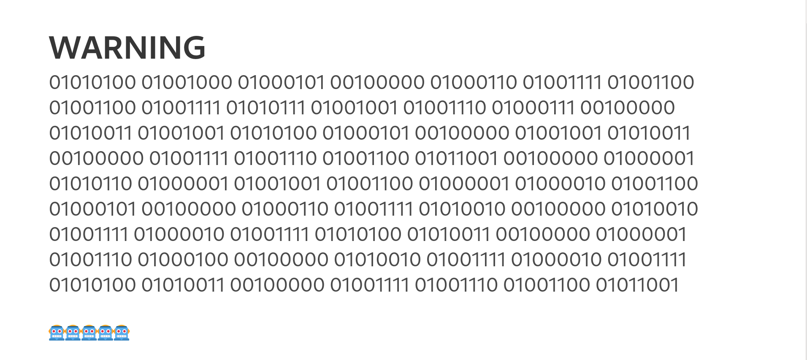

# Web

## YOUTUBE-TRAILER


### Info


## solution:

Just check the html source code and search for ping{


### flag:
`ping{hello_welcome_to_ping_ctf}`
	


## INTERNET-EXPLORER


### Info


## solution:

after reading the description the first thing to try is changing some http headers
so i just searched for user agents for Internet Explorer and i found `Mozilla/5.0 (Windows NT 6.1; Trident/7.0; rv:11.0) like Gecko`
and then replace `Windows` with `linux`  `Mozilla/5.0 (linux NT 6.1; Trident/7.0; rv:11.0) like Gecko`


### flag:
`ping{the_best_browser_ever_made111}`

## path-traversal-101


### Info


## solution:

#### step1:
from the binary warning message or the source code:


it's telling us that `THE FOLLOWING SITE IS ONLY AVAILABLE FOR ROBOTS AND ROBOTS ONLY`
so we check of course `/robots.txt` 
we get:

```
User-agent: *
Disallow: /🤖
```
when i checked the `/🤖`


#### step2:

from the source code we have :
```javascript
export default (req, res, next) => {
    const userAgent = req.get("User-Agent");
    if (userAgent == "robot") {
        next();
    } else {
        res.render("robot", { error: "🤖🤖🤖🤖🤖" });
    }
};
```

```javascript
app.get("/%F0%9F%A4%96", robot, (req, res) => {
    const token = req.cookies.token;
    .
    .
    .
```

so it's always check if the userAgent is robot or it will dispplay the error `🤖🤖🤖🤖🤖`

so we change the user agent and we get :


#### step3:

after reading the source code we undersatnad that the app has 3 questions about path-traversal 
if u answer all 3 you get the flag (ur answers are stored in a token)

```javascript
if (!token) {
        const session = createSession();
        sessions.push(session);
        res.cookie("token", session.id);
        res.render("exam", {
            task: tasks[0],
        });
    } else {
        const session = sessions.find((session) => session.id === token);
        if (!session) {
            const session = createSession();
            sessions.push(session);
            res.cookie("token", session.id);
            res.render("exam", {
                task: tasks[0],
            });
        } else {
            if (!session.task1) {
                res.render("exam", {
                    task: tasks[0],
                });
```

the 3 questions have some conditions that you should bypass it

```javascript
export const tasks = [
    `if (!solution.startsWith("/robot") || solution.endsWith("/flag")) {
    throw new Error(
        "You cannot access the flag!!! You are UNAUTHORIZED!!! 🤖🤖🤖🤖🤖"
    );
}

const solutionPath = path.join("/", solution);
return solutionPath === "/flag";`,
    `solution = solution.replaceAll("../", "");
    if (solution === "/flag") {
        throw new Error(
            "You cannot ACCESS the flag!!! You are UNAUTHORIZED!!! 🤖🤖🤖🤖🤖"
        );
    }

    const solutionPath = path.join("/", solution);
    return solutionPath === "/flag";`,
    `if (solution.includes("../") || solution === "/flag") {
    throw new Error(
        "You CANNOT ACCESS the flag!!! You are UNAUTHORIZED!!! 🤖🤖🤖🤖🤖"
    );
}

const solutionPath = path.join("/", solution);
return solutionPath === "/flag";`,
];
```

for the first one the payload :
`solution=/robot/../flag/.`

second:
`solution=/flag/./` or `solution=/robot/..././flag/.`

third one:
`solution=//flag`

after sending the last solution we get the flag

### flag:
`ping{p4th_tr4V3Rs4L_06c22f693acd46015891c98cb72f45e3}`


# Crypto

##  ancient-genius 

### Info


## solution:

it's values from fibonacci sequence we have to get the order of each number in the fib 
the order represent the ascci:


```python
def fibonacci_order(n):
    a, b = 0, 1
    order = 0

    while a < n:
        a, b = b, a + b
        order += 1

    if a == n:
        return order
    else:
        return -1  


flag=''
fib=[114059301025943970552219, 3928413764606871165730, 43566776258854844738105, 1500520536206896083277,22698374052006863956975682, 781774079430987230203437, 573147844013817084101, 483162952612010163284885,781774079430987230203437, 70492524767089125814114 , 3311648143516982017180081, 83621143489848422977, 31940434634990099905, 927372692193078999176 ,16641027750620563662096,83621143489848422977,1500520536206896083277,83621143489848422977,59425114757512643212875125]
for n in fib:
	fibonacci_number = n
	result = fibonacci_order(fibonacci_number)
	if result != -1:
	    flag+=chr(result)
	else:
	    print(f"{fibonacci_number} is not a Fibonacci number.")
                        
print(flag)              
```


### flag:
```bash
┌──(mo㉿ElMo)-[~/Documents/CTF]
└─$ python3 sol.py
ping{testowa_flaga}
```


	
