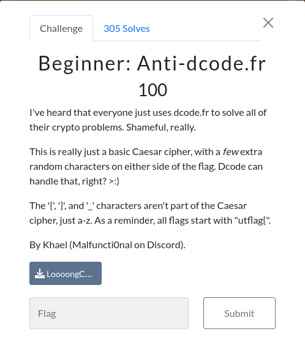

# Crypto

##  Beginner: Anti-dcode.fr 


### Info




## solution:

As the description said we cant use any online tool because the [data](LoooongCaesarCipher.txt) is big(1MB) so we gotta do some python scripting

```python
def caesar_cipher(text, shift):
    result = ""
    for char in text:
        if char.isalpha():
            shifted = ord(char) + shift
            if char.islower():
                if shifted > ord('z'):
                    shifted -= 26
                elif shifted < ord('a'):
                    shifted += 26
            elif char.isupper():
                if shifted > ord('Z'):
                    shifted -= 26
                elif shifted < ord('A'):
                    shifted += 26
            result += chr(shifted)
        else:
            result += char
    return result

def find_string_in_decrypted_text(decrypted_text, search_string):
    index = decrypted_text.find(search_string)
    if index != -1:
        return decrypted_text[index:index+len(search_string)+10]
    return None

def brute_force_caesar_cipher(ciphertext, search_string=None):
    for shift in range(1, 26):
        decrypted_text = caesar_cipher(ciphertext, shift)
        if search_string:
            found_string = find_string_in_decrypted_text(decrypted_text, search_string)
            if found_string:
                print(f"Shift {shift}: {found_string}")
                break
        else:
            print(f"Shift {shift}: {decrypted_text}")

if __name__ == "__main__":
    file_path = "LoooongCaesarCipher.txt"
    with open(file_path, "r") as file:
        ciphertext = file.read()
    string_to_find = input("Enter the string to find (leave empty if not needed): ")
    brute_force_caesar_cipher(ciphertext, string_to_find)
```

```bash
┌──(mo㉿ElMo)-[~/…/CTF/UTctf/Crypto/Beginner: Anti-dcode.fr]
└─$ python3 solve.py             
Enter the string to find (leave empty if not needed): utflag{
Shift 18: utflag{rip_dcode}
```

