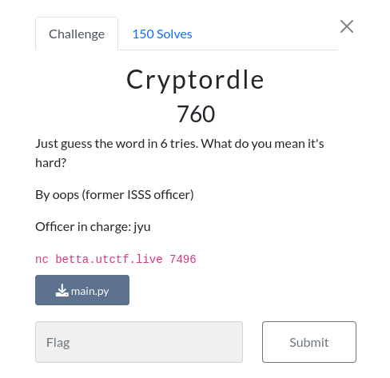

# Web

## ctfc


### Info



```python
#!/usr/bin/env python3
import random

wordlist = open('/src/wordlist.txt', 'r').read().split('\n')

for word in wordlist:
    assert len(word) == 5
    for letter in word:
        assert letter in 'abcdefghijklmnopqrstuvwxyz'

for attempt in range(3):
    answer = random.choice(wordlist)
    num_guesses = 0
    while True:
        num_guesses += 1

        print("What's your guess?")
        guess = input().lower()

        assert len(guess) == 5
        for letter in guess:
            assert letter in 'abcdefghijklmnopqrstuvwxyz'

        if guess == answer:
            break

        response = 1
        for x in range(5):
            a = ord(guess[x]) - ord('a')
            b = ord(answer[x]) - ord('a')
            response = (response * (a-b)) % 31
        print(response)
    if num_guesses > 6:
        print("Sorry, you took more than 6 tries. No flag for you :(")
        exit()
    else:
        print("Good job! Onward...")

if num_guesses <= 6:
    print('Nice! You got it :) Have a flag:')
    flag = open('/src/flag.txt', 'r').read()
    print(flag)
else:
    print("Sorry, you took more than 6 tries. No flag for you :(")
```
## solution
the intended solution without just bruteforcing randomly , is to understand this loop:

```python    
response = 1
        for x in range(5):
            a = ord(guess[x]) - ord('a')
            b = ord(answer[x]) - ord('a')
            response = (response * (a-b)) % 31
```
this loop actually do this:
`(a1-b1)*(a2-b2)*(a3-b3)*(a4-b4)*(a5-b5)=response`
and we have A's are known, we got 5 inputs before we have to guess the word 
so 5 input , 5 outputs , 5 unknowns we can build a linear equations system and solve it for b1....b5
[here the solve script](./CRACKword.py)


