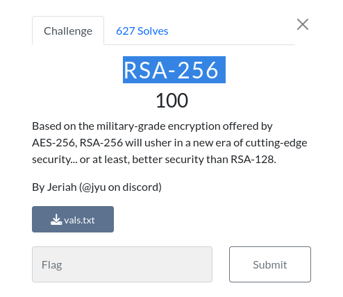

# Crypto

## RSA-256


### Info



it's simple RSA probleme with small n so we just factorised it 
```python
from Crypto.Util.number import*

N = 77483692467084448965814418730866278616923517800664484047176015901835675610073
e = 65537
c = 43711206624343807006656378470987868686365943634542525258065694164173101323321

p=1025252665848145091840062845209085931
q=75575216771551332467177108987001026743883
phi=(p-1)*(q-1)
d=inverse(e,phi)
flag=long_to_bytes(pow(c,d,N))
print(flag.decode())
```

```bash
──(mo㉿ElMo)-[~/Documents/CTF/UTctf/Crypto]
└─$ python3 try.py
utflag{just_send_plaintext}
```


