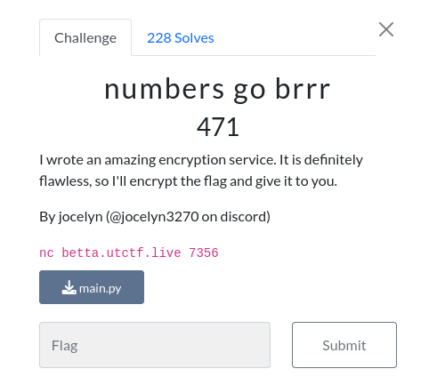
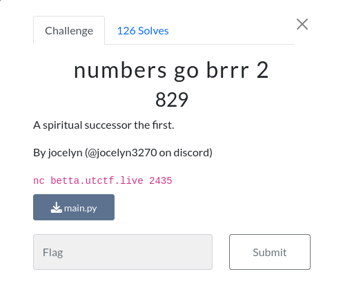

# Crypto

## numbers go brrr


### Info



 first challenge was basically just generate a random seed (can be brutforced) then genereate am AES key using this seed with a  function  so the solution is to bruteforce the seed to get the exact seed that generate the exact AES key since the seed doesnt change in the session so:
 
```python
#utflag{deep_seated_and_recurring_self-doubts}
#!/usr/bin/env python3
from Crypto.Cipher import AES
from Crypto.Util.Padding import unpad, pad

def get_random_number():
    global seed 
    seed = int(str(seed * seed).zfill(12)[3:9])
    return seed

def decrypt(c):
    key = b''
    for i in range(8):
        key += (get_random_number() % (2 ** 16)).to_bytes(2, 'big')
    cipher = AES.new(key, AES.MODE_ECB)
    plain = cipher.decrypt(pad(c, AES.block_size))
    plain = unpad(plain,AES.block_size)
    return plain
    
c=[here the flag encrypted from the server]
ciphertext = bytes.fromhex(c)
for i in range(1000000):
    seed = i
    flag=decrypt(ciphertext)
    if b'utflag{'in flag:
    	print(flag)
    	break
```
  
## numbers go brrr2


### Info



it was a revenge maybe? but same solution just u have to use exact way that the server is using the sequences because now the seed and the key changes everytime and you have to guess it three times to get the flag

repeat this one three times and every time pass the guessed key to the server and u will get the flag:

```python
def get_random_number():
    global seed 
    seed = int(str(seed * seed).zfill(12)[3:9])
    return seed
    
def encrypt(message):
    key = b''
    for i in range(8):
        key += (get_random_number() % (2 ** 16)).to_bytes(2, 'big')
    cipher = AES.new(key, AES.MODE_ECB)
    ciphertext = cipher.encrypt(pad(message, AES.block_size))
    return key.hex(), ciphertext.hex()
c='d8b71c40844c5fe15dec19beb722710b'[here the encrypted message ]

for i in range(1000000):
    seed = i
    plain='amine' 
    key = encrypt(b"random text to initalize key")[0]
    key, ciphertext = encrypt(plain.encode())
    if(ciphertext==c):
    	
        	print("Here is your guessed key:",key)
                
        	break


