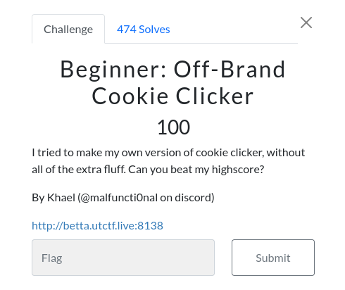
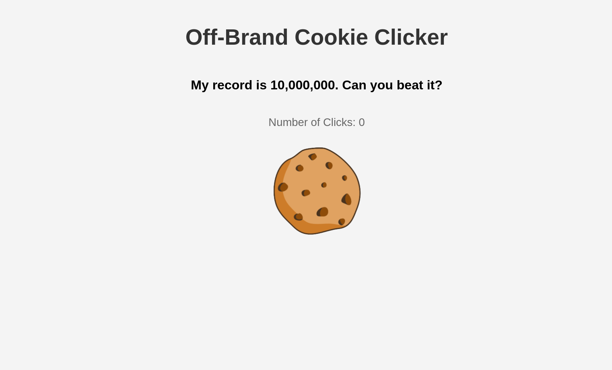
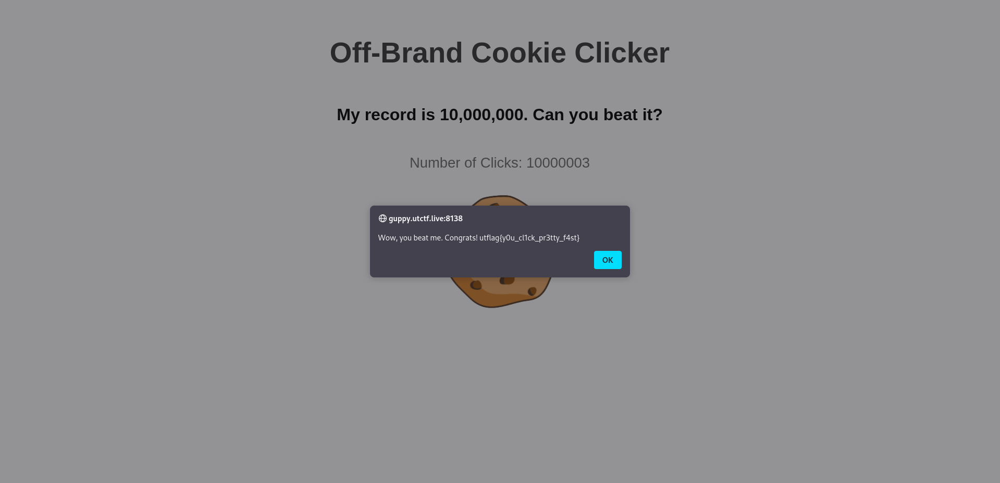

# OFF-Brand Cookie Clicker

## ctfc


### Info





The challenge needs u to click 10,000,001 to get the flag , even auto clicker cant do it

```JS
 <script>
        document.addEventListener('DOMContentLoaded', function() {
            var count = parseInt(localStorage.getItem('count')) || 0;
            var cookieImage = document.getElementById('cookieImage');
            var display = document.getElementById('clickCount');

            display.textContent = count;

            cookieImage.addEventListener('click', function() {
                count++;
                display.textContent = count;
                localStorage.setItem('count', count);

                if (count >= 10000000) {
                    fetch('/click', {
                        method: 'POST',
                        headers: {
                            'Content-Type': 'application/x-www-form-urlencoded'
                        },
                        body: 'count=' + count
                    })
                    .then(response => response.json())
                    .then(data => {
                        alert(data.flag);
                    });
                }
            });
        });
    </script>
```
## solution
check the local storage of the browser you will find the variable count since it uses`localStorage.setItem('count', count);`
modify the variable to 10000000 then refresh, now click on the cookie and u will get the flag





