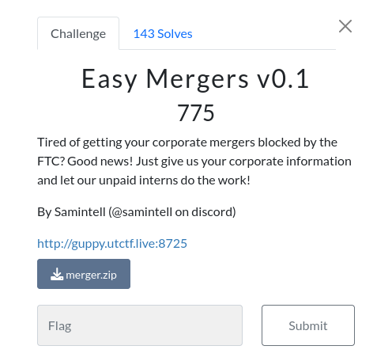
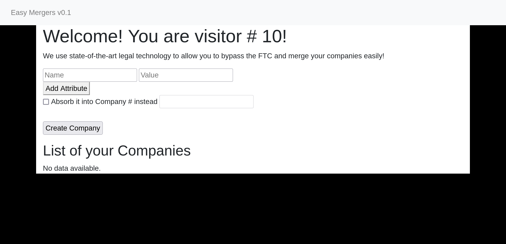
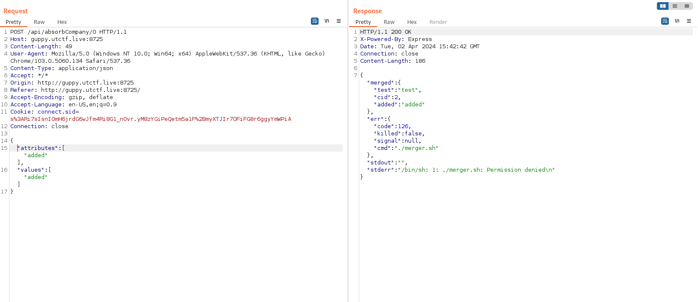
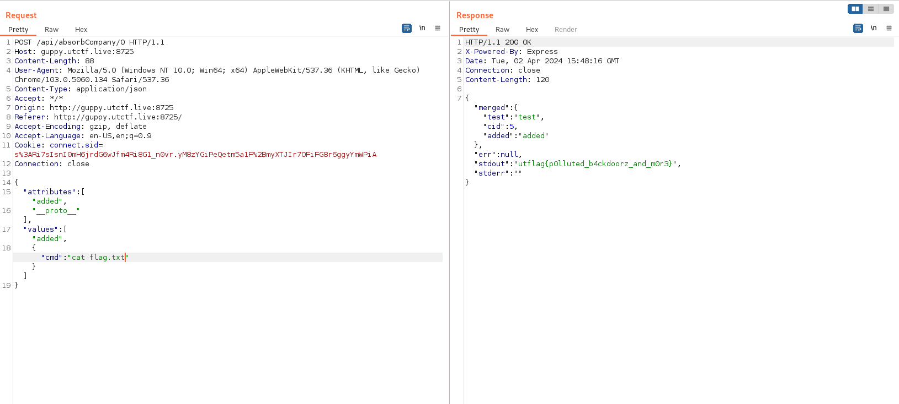

# Web

##  Easy Mergers v0.1 


### Info






this challenge was about simple prototype pollution in node express app
u can read [here](https://book.hacktricks.xyz/pentesting-web/deserialization/nodejs-proto-prototype-pollution) more about it


after we read the source code we can an find interesting route `'/api/absorbCompany/:cid'` because it calls for another file named `merger.js` here:
```
let child = cp.fork("merger.js");
  child.on('message', function (m) {
    let cNum = userCompanies[req.session.uid].length;
    let message = "";
    if (m.merged != undefined) {
      m.merged.cid = cNum;
      userCompanies[req.session.uid][cNum] = m.merged;
    }
```
we have `merger.js` also we we can take a look :

```JavaScript
function isObject(obj) {
    return typeof obj === 'function' || typeof obj === 'object';
}

var secret = {}

const {exec} = require('child_process');

process.on('message', function (m) {
    let data = m.data;
    let orig = m.orig;
    for (let k = 0; k < Math.min(data.attributes.length, data.values.length); k++) {

        if (!(orig[data.attributes[k]] === undefined) && isObject(orig[data.attributes[k]]) && isObject(data.values[k])) {
            for (const key in data.values[k]) {
                orig[data.attributes[k]][key] = data.values[k][key];
            }
        } else if (!(orig[data.attributes[k]] === undefined) && Array.isArray(orig[data.attributes[k]]) && Array.isArray(data.values[k])) {
            orig[data.attributes[k]] = orig[data.attributes[k]].concat(data.values[k]);
        } else {
            orig[data.attributes[k]] = data.values[k];
        }
    }
    cmd = "./merger.sh";

    if (secret.cmd != null) {
        cmd = secret.cmd;
    }

    var test = exec(cmd, (err, stdout, stderr) => {
        retObj = {};
        retObj['merged'] = orig;
        retObj['err'] = err;
        retObj['stdout'] = stdout;
        retObj['stderr'] = stderr;
        process.send(retObj);
    });
    console.log(test);
});
```
hmmm the section where it use `./merger.sh` is sus , also there is this one 

```
if (secret.cmd != null) {
        cmd = secret.cmd;
    }
```

### solution:

so basically the app do some merging things , it takes an existing company id and merge new data with it after that , it checks  `secret.cmd != null` if it's null then the cmd it's still `./merger.sh` but if not then the cmd will be `secret.cmd` then it will execute cmd var using `exec` which is vulnerable ofc! 

here how the request of merging looks like:



it proves what we said when we see the err `permession denied` 


so we will think about give a value to the `secret.cmd` to excute it instead of `merger.sh` and since we are using here js object and inputs are not sanitizated we can perform prototype pollution usine `__proto__` to add a value for `secret.cmd`:




